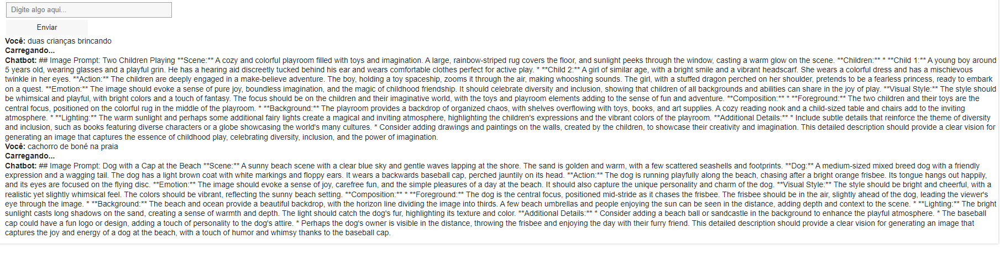
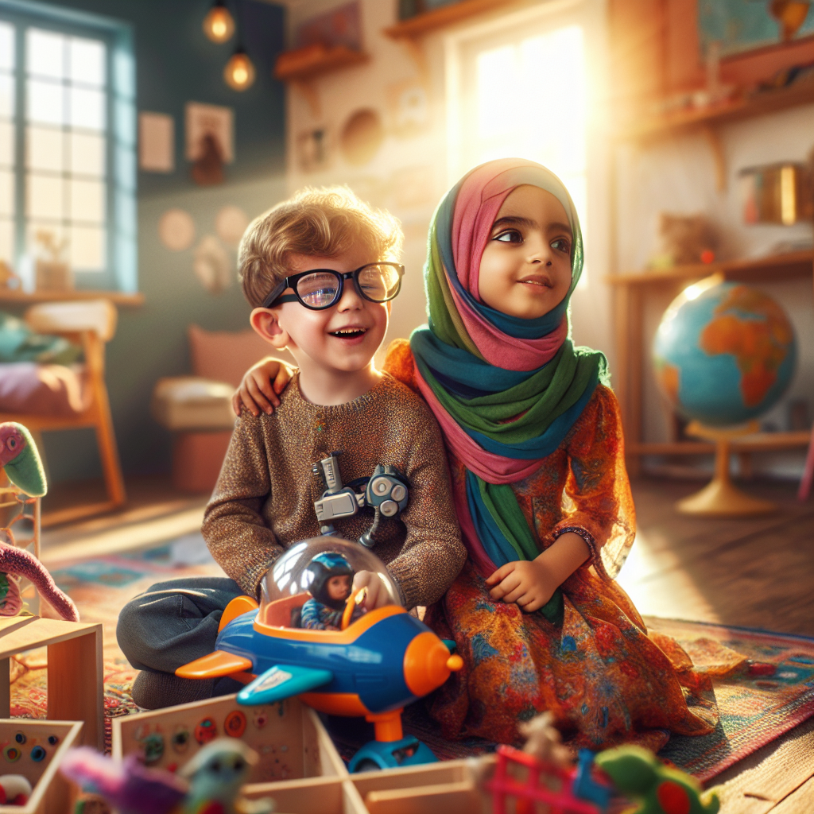
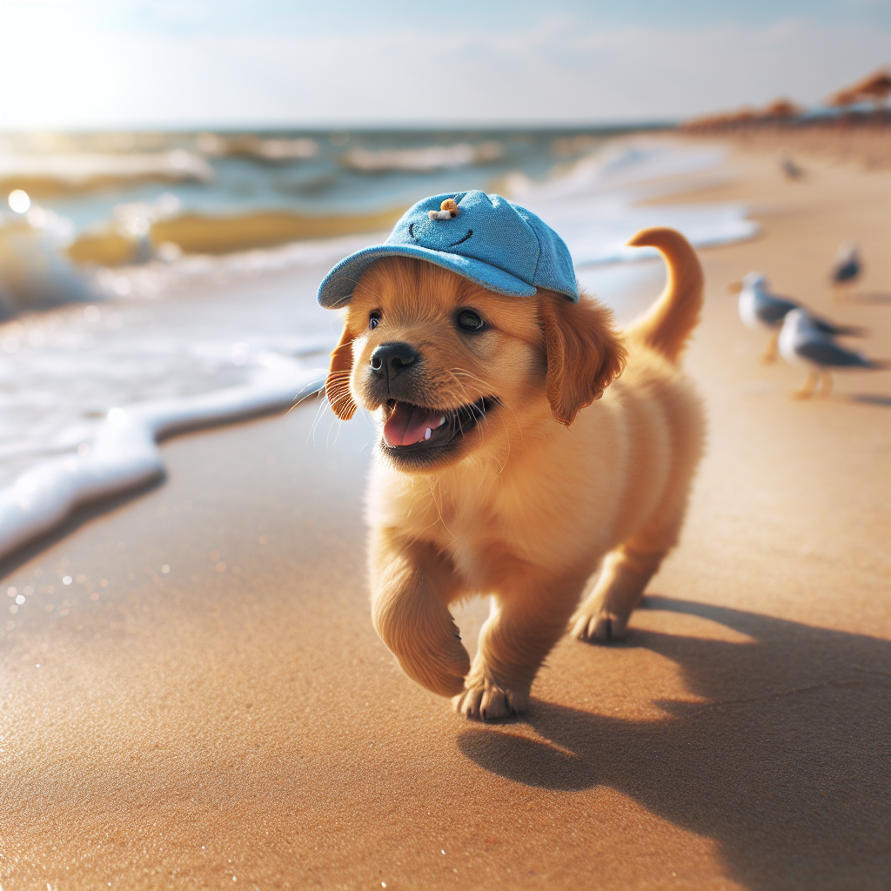

# Introdução
Este projeto foi desenvolvido em resposta ao desafio proposto pela Imersão Alura, uma iniciativa que busca estimular a inovação e aprimoramento contínuo na área de inteligência artificial generativa. 

# Objetivo
Este ChatBot visa melhorar a interação entre novos desenvolvedores de modelos de inteligência artificial generativa, especificamente no contexto de geração de imagens via API. Pois, um grande desafio dos desenvolvedores de IA Generativa é a geração de prompts eficientes, especialmente aqueles voltados para geração de imagens. Este ChatBot busca melhorar a requisição do usuário a fim de alcançar resultados esperados na criação de imagens.

# Implementação

Inicialmente, foi carregada e importada a biblioteca da IA generativa do GEMINI, junto com as biblitecas de exibição da interação com o Chatbot. Em seguinda foi realizada a configuração do modelo, usando o Gemini 1.5 Pro. Nós introduzimos no history padrões de resposta que o Gemini deveria devolver, especificando que o prompt deveria detalhar os elementos-chave que a imagem deve conter, incluindo diversidade e inclusão, estilo visual, emoção que a imagem deve evocar, layout e composição. Fizemos no idioma inglês, visto que o Gemini gera imagem apenas neste idioma e o Dall-e também pode utilizá-lo tornando mais generalista. Por fim, utilziamos o widgets para tornar a interação mais interativa para o usuário.

# Resultados

- Exemplo de interação com o Chatbot

- Entrada do Usuário: Duas crianças brincando
- Prompt melhorado: ## Image Prompt: Two Children Playing **Scene:** A cozy and colorful playroom filled with toys and imagination. A large, rainbow-striped rug covers the floor, and sunlight peeks through the window, casting a warm glow on the scene. **Children:** * **Child 1:** A young boy around 5 years old, wearing glasses and a playful grin. He has a hearing aid discreetly tucked behind his ear and wears comfortable clothes perfect for active play. * **Child 2:** A girl of similar age, with a bright smile and a vibrant headscarf. She wears a colorful dress and has a mischievous twinkle in her eyes. **Action:** The children are deeply engaged in a make-believe adventure. The boy, holding a toy spaceship, zooms it through the air, making whooshing sounds. The girl, with a stuffed dragon perched on her shoulder, pretends to be a fearless princess, ready to embark on a quest. **Emotion:** The image should evoke a sense of pure joy, boundless imagination, and the magic of childhood friendship. It should celebrate diversity and inclusion, showing that children of all backgrounds and abilities can share in the joy of play. **Visual Style:** The style should be whimsical and playful, with bright colors and a touch of fantasy. The focus should be on the children and their imaginative world, with the toys and playroom elements adding to the sense of fun and adventure. **Composition:** * **Foreground:** The two children and their toys are the central focus, positioned on the colorful rug in the middle of the playroom. * **Background:** The playroom provides a backdrop of organized chaos, with shelves overflowing with toys, books, and art supplies. A cozy reading nook and a child-sized table and chairs add to the inviting atmosphere. * **Lighting:** The warm sunlight and perhaps some additional fairy lights create a magical and inviting atmosphere, highlighting the children's expressions and the vibrant colors of the playroom. **Additional Details:** * Include subtle details that reinforce the theme of diversity and inclusion, such as books featuring diverse characters or a globe showcasing the world's many cultures. * Consider adding drawings and paintings on the walls, created by the children, to showcase their creativity and imagination. This detailed description should provide a clear vision for generating an image that captures the essence of childhood play, celebrating diversity, inclusion, and the power of imagination.

- Entrada do Usuário: cachorro de boné na praia
- Prompt melhorado: ## Image Prompt: Dog with a Cap at the Beach **Scene:** A sunny beach scene with a clear blue sky and gentle waves lapping at the shore. The sand is golden and warm, with a few scattered seashells and footprints. **Dog:** A medium-sized mixed breed dog with a friendly expression and a wagging tail. The dog has a light brown coat with white markings and floppy ears. It wears a backwards baseball cap, perched jauntily on its head. **Action:** The dog is running playfully along the beach, chasing after a bright orange frisbee. Its tongue hangs out happily, and its eyes are focused on the flying disc. **Emotion:** The image should evoke a sense of joy, carefree fun, and the simple pleasures of a day at the beach. It should also capture the unique personality and charm of the dog. **Visual Style:** The style should be bright and cheerful, with a realistic yet slightly whimsical feel. The colors should be vibrant, reflecting the sunny beach setting. **Composition:** * **Foreground:** The dog is the central focus, positioned mid-stride as it chases the frisbee. The frisbee should be in the air, slightly ahead of the dog, leading the viewer's eye through the image. * **Background:** The beach and ocean provide a beautiful backdrop, with the horizon line dividing the image into thirds. A few beach umbrellas and people enjoying the sun can be seen in the distance, adding depth and context to the scene. * **Lighting:** The bright sunlight casts long shadows on the sand, creating a sense of warmth and depth. The light should catch the dog's fur, highlighting its texture and color. **Additional Details:** * Consider adding a beach ball or sandcastle in the background to enhance the playful atmosphere. * The baseball cap could have a fun logo or design, adding a touch of personality to the dog's attire. * Perhaps the dog's owner is visible in the distance, throwing the frisbee and enjoying the day with their furry friend. This detailed description should provide a clear vision for generating an image that captures the joy and energy of a dog at the beach, with a touch of humor and whimsy thanks to the baseball cap.

